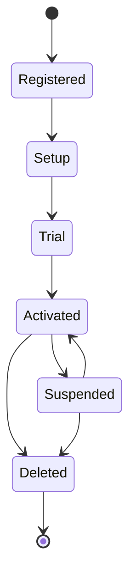

# Tenant Provisioning Specification for Aether SaaS Platform

## 1. Tenant Lifecycle

The tenant lifecycle represents the complete flow of a tenant's existence within the Aether SaaS platform, from initial registration to final deletion. This lifecycle includes the following stages:

1. **Registration** - The tenant is registered in the system with basic information.
2. **Setup** - Initial configuration of the tenant's environment (DB schema, Redis keyspace, etc.).
3. **Trial** - The tenant enters a trial period with limited features.
4. **Activation** - The tenant is activated and can use the full features of the platform.
5. **Suspension** - The tenant's access is suspended (e.g., due to billing issues).
6. **Deletion** - The tenant is deleted, with soft delete followed by hard delete after a retention period.

### State Diagram



### Lifecycle Flow

```json
{
  "lifecycle": {
    "registered": {
      "description": "Tenant registered with basic details",
      "next_states": ["setup"]
    },
    "setup": {
      "description": "Initial provisioning of tenant resources",
      "next_states": ["trial"]
    },
    "trial": {
      "description": "Trial period with limited access",
      "next_states": ["activated", "deleted"]
    },
    "activated": {
      "description": "Full access enabled",
      "next_states": ["suspended", "deleted"]
    },
    "suspended": {
      "description": "Access suspended, can be reactivated",
      "next_states": ["activated", "deleted"]
    },
    "deleted": {
      "description": "Tenant data soft deleted",
      "next_states": ["*"]
    }
  }
}
```

## 2. Provisioning Process

The provisioning process for a new tenant involves several steps:

1. **Database Schema Creation**: Create schema and tables (PostgreSQL).
2. **Initial Migrations**: Run Alembic migrations for the tenant.
3. **Configuration**: Apply default settings and configurations.
4. **Seed Data**: Populate with initial data (users, settings, etc.).
5. **Resource Allocation**: Set up Redis keyspace, file storage.
6. **Tenant Service Initialization**: Register with TenantService.

### Provisioning Steps

```json
{
  "provisioning_steps": [
    {
      "step": "schema_creation",
      "description": "Create PostgreSQL schema and tables"
    },
    {
      "step": "alembic_migration",
      "description": "Run tenant-specific Alembic migrations"
    },
    {
      "step": "config_apply",
      "description": "Apply default configuration settings"
    },
    {
      "step": "seed_data",
      "description": "Populate with initial data"
    },
    {
      "step": "resource_allocation",
      "description": "Set up Redis keyspace, file storage"
    },
    {
      "step": "tenant_service_registration",
      "description": "Register tenant with TenantService"
    }
  ]
}
```

## 3. Tenant Isolation

Tenant isolation is implemented at three levels:

1. **ContextVar**: Thread-local storage for tenant context.
2. **PostgreSQL RLS**: Row-Level Security policies to isolate tenant data.
3. **Redis Prefix**: Namespace tenant data in Redis.
4. **File Storage**: Separate directories for each tenant.

### Isolation Details

#### ContextVar

```json
{
  "context_var": {
    "description": "Thread-local context for tenant identification",
    "key": "tenant_id",
    "scope": "request_context"
  }
}
```

#### PostgreSQL RLS

```sql
-- Policy to ensure tenant data isolation
CREATE POLICY tenant_isolation_policy ON your_table
FOR ALL TO PUBLIC
USING (tenant_id = current_setting('app.current_tenant_id')::uuid);
```

#### Redis Prefix

```json
{
  "redis_prefix": {
    "format": "tenant:{tenant_id}:{key}",
    "example": "tenant:123e4567-e89b-12d3-a456-426614174000:session:abc123"
  }
}
```

#### File Storage

```json
{
  "file_storage": {
    "base_path": "/storage/tenants",
    "structure": "/storage/tenants/{tenant_id}/{relative_path}"
  }
}
```

## 4. White-Label Configuration

The platform supports white-label configurations for each tenant, including:

1. **Custom Domain**: Each tenant can have its own domain.
2. **Logo**: Custom branding image.
3. **Primary Color**: Custom color theme.
4. **Timezone**: Tenant-specific timezone.
5. **Locale**: Language and regional settings.

### White-Label Schema

```json
{
  "white_label_config": {
    "custom_domain": {
      "type": "string",
      "description": "Custom domain for the tenant"
    },
    "logo_url": {
      "type": "string",
      "description": "URL to custom logo"
    },
    "primary_color": {
      "type": "string",
      "description": "Hex color code for primary branding"
    },
    "timezone": {
      "type": "string",
      "description": "Tenant timezone (IANA format)"
    },
    "locale": {
      "type": "string",
      "description": "Language and region codes"
    }
  }
}
```

## 5. Feature Flags

Feature flags are implemented at two levels:

1. **System-Level**: Global features that apply to all tenants.
2. **Tenant-Level**: Features that are enabled/disabled per tenant.

### Feature Flag Schema

```json
{
  "feature_flag": {
    "system": {
      "type": "boolean",
      "description": "Global feature flag"
    },
    "tenant": {
      "type": "boolean",
      "description": "Tenant-specific feature flag"
    }
  }
}
```

## 6. Rate Limiting

Rate limiting is implemented using a token bucket algorithm and Redis.

1. **Per-Tenant Limits**: Each tenant has its own rate limit.
2. **Token Bucket**: Implements a token-based rate limiting system.
3. **Redis Implementation**: Stores and updates token buckets in Redis.

### Rate Limit Schema

```json
{
  "rate_limit": {
    "tokens_per_second": {
      "type": "integer",
      "description": "Number of tokens added per second"
    },
    "max_tokens": {
      "type": "integer",
      "description": "Maximum number of tokens in the bucket"
    }
  }
}
```

## 7. Tenant Migration

Tenant data migrations are managed with Alembic and are RLS-safe to ensure data isolation.

1. **Alembic Migrations**: Standard database migration system.
2. **RLS-Safe**: Migrations do not break RLS policies.

### Migration Steps

```json
{
  "migration_steps": [
    {
      "step": "alembic_revision",
      "description": "Generate new Alembic revision"
    },
    {
      "step": "apply_revision",
      "description": "Apply migration to tenant schema"
    },
    {
      "step": "validate_rls",
      "description": "Ensure RLS policies still apply"
    }
  ]
}
```

## 8. Subscription Tiers

Subscription tiers define the features and limits available to tenants.

1. **Free**: Basic access with limits.
2. **Starter**: Additional features.
3. **Professional**: Advanced features.
4. **Enterprise**: Full access, custom solutions.

### Subscription Tier Schema

```json
{
  "subscription_tiers": {
    "Free": {
      "features": ["basic_access", "limited_storage"],
      "limits": {
        "max_users": 5,
        "storage_gb": 10
      }
    },
    "Starter": {
      "features": ["all_free_features", "advanced_reporting"],
      "limits": {
        "max_users": 20,
        "storage_gb": 50
      }
    },
    "Professional": {
      "features": ["all_starter_features", "custom_domains"],
      "limits": {
        "max_users": 100,
        "storage_gb": 200
      }
    },
    "Enterprise": {
      "features": ["all_professional_features", "dedicated_support"],
      "limits": {
        "max_users": 500,
        "storage_gb": 1000
      }
    }
  }
}
```

## 9. Trial Management

Trial management includes:

1. **Trial Period**: Duration of trial.
2. **Conversion**: Transition from trial to paid subscription.
3. **Expiry**: Automatic handling of trial expiration.

### Trial Schema

```json
{
  "trial": {
    "duration_days": {
      "type": "integer",
      "description": "Number of days for trial period"
    },
    "auto_convert": {
      "type": "boolean",
      "description": "Automatically convert to paid subscription"
    }
  }
}
```

## 10. Tenant Deletion

Tenant deletion is handled with a soft-delete followed by a hard-delete after a retention period.

1. **Soft Delete**: Mark tenant as deleted.
2. **Retention Period**: Data retained for N days.
3. **Hard Delete**: Permanent deletion and cleanup.

### Deletion Schema

```json
{
  "deletion_process": {
    "soft_delete": {
      "description": "Mark tenant as deleted"
    },
    "retention_days": {
      "type": "integer",
      "description": "Days to retain data before hard delete"
    },
    "hard_delete": {
      "description": "Permanently delete tenant data"
    }
  }
}
```

## 11. Database Schema

The following database tables are used to manage tenant information:

1. **tenants**: Core tenant information.
2. **tenant_subscriptions**: Subscription details.
3. **tenant_configs**: Configuration settings.
4. **tenant_features**: Feature flags.
5. **tenant_limits**: Rate and usage limits.
6. **tenant_domains**: Custom domains.

### Schema Definitions

```sql
-- tenants table
CREATE TABLE tenants (
  id UUID PRIMARY KEY,
  name VARCHAR(255),
  created_at TIMESTAMP DEFAULT NOW(),
  updated_at TIMESTAMP DEFAULT NOW(),
  deleted_at TIMESTAMP
);

-- tenant_subscriptions table
CREATE TABLE tenant_subscriptions (
  id UUID PRIMARY KEY,
  tenant_id UUID REFERENCES tenants(id),
  tier VARCHAR(50),
  active BOOLEAN,
  created_at TIMESTAMP DEFAULT NOW(),
  updated_at TIMESTAMP DEFAULT NOW()
);

-- tenant_configs table
CREATE TABLE tenant_configs (
  id UUID PRIMARY KEY,
  tenant_id UUID REFERENCES tenants(id),
  config JSONB,
  created_at TIMESTAMP DEFAULT NOW()
);

-- tenant_features table
CREATE TABLE tenant_features (
  id UUID PRIMARY KEY,
  tenant_id UUID REFERENCES tenants(id),
  feature_flag VARCHAR(255),
  enabled BOOLEAN
);

-- tenant_limits table
CREATE TABLE tenant_limits (
  id UUID PRIMARY KEY,
  tenant_id UUID REFERENCES tenants(id),
  limit_type VARCHAR(50),
  value INTEGER
);

-- tenant_domains table
CREATE TABLE tenant_domains (
  id UUID PRIMARY KEY,
  tenant_id UUID REFERENCES tenants(id),
  domain VARCHAR(255),
  is_primary BOOLEAN
);
```

## 12. Admin API

The Admin API provides endpoints for managing tenants:

1. **Create Tenant**
2. **Update Tenant**
3. **Get Tenant**
4. **Delete Tenant**
5. **List Tenants**
6. **Monitor Tenants**

### Admin API Endpoints

```json
{
  "admin_api_endpoints": {
    "create_tenant": {
      "method": "POST",
      "path": "/admin/tenants",
      "description": "Create a new tenant"
    },
    "update_tenant": {
      "method": "PUT",
      "path": "/admin/tenants/{id}",
      "description": "Update tenant information"
    },
    "get_tenant": {
      "method": "GET",
      "path": "/admin/tenants/{id}",
      "description": "Get tenant details"
    },
    "delete_tenant": {
      "method": "DELETE",
      "path": "/admin/tenants/{id}",
      "description": "Delete tenant"
    },
    "list_tenants": {
      "method": "GET",
      "path": "/admin/tenants",
      "description": "List all tenants"
    },
    "monitor_tenants": {
      "method": "GET",
      "path": "/admin/tenants/monitor",
      "description": "Monitor tenant status"
    }
  }
}
```

This specification provides a detailed overview of the Tenant Provisioning process for the Aether SaaS platform, including all lifecycle stages, provisioning steps, isolation mechanisms, configuration options, and API endpoints.
